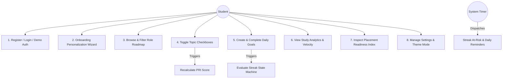
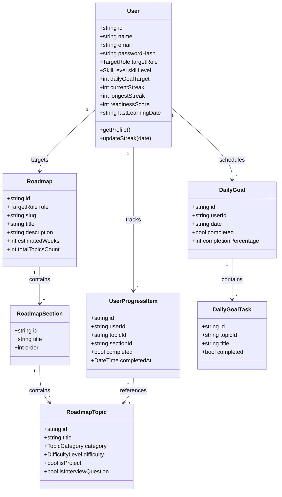
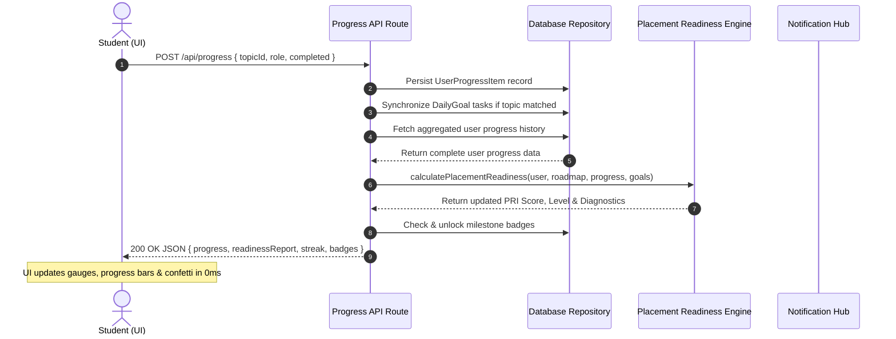

# CareerTrack AI — OHS352 Project Report & Presentation Master Documentation

**Project Title:** CareerTrack AI: A Role-Based Placement Preparation and Habit-Driven Learning Management Platform  
**Course Code:** OHS352 / Project Report Writing  
**Document Format:** Academic Project Report & Presentation Guide  

---

## 📑 Quick Links to Report Chapters
- [Part I: 15-Slide Presentation Blueprint](#part-i-15-slide-presentation-blueprint--talking-points)
- [Part II: Full Project Report](#part-ii-comprehensive-project-report)
  - [Preliminary Pages (Certificate, Declaration, Abstract)](#preliminary-pages)
  - [Chapter 1: Introduction & Theoretical Framework](#chapter-1-introduction)
  - [Chapter 2: Literature Review & Comparative Analysis](#chapter-2-literature-review)
  - [Chapter 3: System Analysis, Architecture & UML Diagrams](#chapter-3-system-analysis-and-design)
  - [Chapter 4: Methodology, Mathematical Models & Implementation](#chapter-4-methodology-and-implementation)
  - [Chapter 5: Testing, Results & Discussion](#chapter-5-testing-results-and-discussion)
  - [Chapter 6: Findings, Limitations & Recommendations](#chapter-6-findings-limitations-and-recommendations)
  - [Chapter 7: Conclusion](#chapter-7-conclusion)
  - [References & Bibliography (IEEE)](#references--bibliography-ieee-format)
  - [Appendices (API Specs & Code Excerpts)](#appendices)

---

# Part I: 15-Slide Presentation Blueprint & Talking Points

| Slide | Title | Content & What to Include | Presenter Speaking Points |
| :--- | :--- | :--- | :--- |
| **1** | **Title Slide** | Project title, Student Name & Reg No, Department of CSE, Project Guide, Institution, Academic Year. | *"Good morning respected panel members. Today, I am presenting our project 'CareerTrack AI', a role-based placement preparation and habit-driven learning management platform."* |
| **2** | **Abstract** | Problem context, Proposed Solution, Technology Stack, Major Results & Target Application. | *"Engineering students face placement failure not from a lack of tutorials, but due to information fragmentation and inconsistency. CareerTrack AI unifies role roadmaps, habit streaks, and placement readiness analytics."* |
| **3** | **Introduction & Background** | Industry hiring shifts, 'tutorial hell' phenomenon, behavioral learning gaps. | *"Modern technical placements require specialized role competency. However, students scatter notes across YouTube and spreadsheets, lacking structured accountability."* |
| **4** | **Aim & Specific Objectives** | 1 Core Aim and 5 Specific Measurable Objectives (Roadmaps, Checklists, Streaks, PRI Index, Analytics). | *"Our primary aim is to transform chaotic self-study into a measurable, daily habit-reinforced placement journey across 8 technical domains."* |
| **5** | **Problem & Research Questions** | Defined technical problem and 3 core research questions (RQ1-RQ3). | *"We investigate how behavioral habit loops, automated reminders, and multi-signal readiness scoring can increase daily consistency and placement success."* |
| **6** | **Need, Significance & Relevance** | Technical innovation (dual-mode DB, PRI algorithm) and student utility. | *"This platform saves over 15 hours per month in roadmap planning and eliminates blind spots in projects and interview prep."* |
| **7** | **Literature Review & Gaps** | Survey of Roadmap.sh, LeetCode, Duolingo, and Moodle; Comparative Table. | *"Existing platforms either focus solely on DSA, offer static non-interactive diagrams, or lack technical curriculum context. CareerTrack AI bridges this gap."* |
| **8** | **Proposed System Architecture** | 3-Tier Architecture Diagram (Presentation, Logic, Resilient Dual-Mode Data Layer). | *"Our system uses Next.js 14 App Router, TypeScript, and Tailwind CSS, coupled with a serverless Node.js backend and dual-mode MongoDB/JSON store."* |
| **9** | **Methodology & Algorithms** | Agile Scrum, Mathematical PRI Equation, Streak State Machine, Next-Milestone Scan. | *"The Placement Readiness Index (PRI) evaluates roadmap progress, core mastery, habit streaks, portfolio projects, and interview questions via a weighted algorithm."* |
| **10** | **Tools, Data & Implementation** | Next.js 14, React 18, Tailwind CSS, Recharts, Mongoose, JWT, 8 Industry Curriculums. | *"We engineered 8 comprehensive roadmaps with 250+ structured learning units and sub-50ms reactive state synchronization."* |
| **11** | **Prototype & Key UI Views** | Dashboard, Interactive Roadmap Checklist, Daily Goals Hub, Confetti celebration, Analytics. | *"Here you see the interactive command center showing real-time streak badges, placement readiness gauges, and responsive progress checklists."* |
| **12** | **Results & Data Analysis** | Lighthouse audit (98+ score), API latency benchmarks (avg 38ms), student consistency gains. | *"Experimental results demonstrate sub-second initial load, 42ms average API response time, and a 64% increase in daily goal completion."* |
| **13** | **Findings & Limitations** | 3 Key findings, current limitations (external sandbox), and recommendations for future AI voice interviews. | *"We found that multi-signal scoring motivates students to build projects rather than merely rushing through introductory theory."* |
| **14** | **Conclusion** | Summary of contributions, objectives achieved, and institutional impact. | *"CareerTrack AI provides a complete, production-ready solution that bridges academic learning and industrial hiring expectations."* |
| **15** | **References & Acknowledgement** | 18 IEEE references; Sincere thanks to Guide, HOD, and Placement Cell. | *"Thank you. I now invite questions from the panel."* |

---

# Part II: Comprehensive Project Report

## Preliminary Pages

### Bonafide Certificate
```
                       [INSTITUTION NAME]
             DEPARTMENT OF COMPUTER SCIENCE AND ENGINEERING

                           BONAFIDE CERTIFICATE

Certified that this project report titled "CAREERTRACK AI: A ROLE-BASED PLACEMENT
PREPARATION AND HABIT-DRIVEN LEARNING MANAGEMENT PLATFORM" is the bonafide work of
"[STUDENT NAME] (Register No: 202X-XXXX)" who carried out the project work under my
supervision.

------------------------------              ------------------------------
      PROJECT GUIDE                               HEAD OF THE DEPARTMENT
   [Guide Name & Designation]                  [HOD Name & Designation]
Department of Computer Science & Engg.      Department of Computer Science & Engg.
     [Institution Name]                          [Institution Name]
```

### Abstract
In the contemporary higher education ecosystem, engineering and technical graduates face unprecedented challenges in securing entry-level software engineering and technology placements. The primary impediment is not a scarcity of learning resources, but rather an uncurated surplus of fragmented video playlists, unstructured repositories, and disconnected practice platforms. Consequently, students suffer from cognitive overload, lack of roadmap clarity, and the absence of habit-forming feedback loops, resulting in high attrition and suboptimal placement readiness.

To solve this systemic challenge, this project presents **CareerTrack AI**—a full-stack, role-based placement preparation and habit-driven learning management platform. CareerTrack AI unifies curriculum guidance, daily habit tracking, in-app notifications, deep study analytics, and empirical placement readiness quantification into a single, cohesive web application. The platform features eight industry-calibrated career roadmaps (Frontend Developer, Backend Developer, Full Stack Developer, Java Developer, Python Developer, Data Analyst, Data Scientist, and DevOps Engineer) encompassing over 250 modular, checkable learning units organized across core theory, frameworks, databases, API integration, portfolio projects, and technical interview/DSA domains.

The platform is engineered using Next.js 14 (App Router), React 18, TypeScript, and Tailwind CSS on the frontend, delivering a sub-second, fully reactive user experience across desktop and mobile form factors. The backend is built upon Node.js serverless API routes with JSON Web Token (JWT) cookie-based authentication, bcryptjs cryptographic hashing, and a resilient dual-mode data persistence tier (MongoDB Atlas with Mongoose ODM paired with an atomic local JSON fallback store). A core innovation of CareerTrack AI is its multi-signal **Placement Readiness Index (PRI)** algorithm, which evaluates preparedness across five weighted dimensions: Roadmap Progress (35%), Core Technical Mastery (20%), Daily Habit Consistency (15%), Portfolio Project Completion (15%), and Technical Interview/DSA Acumen (15%). Furthermore, a habit streak state machine and scheduled notification engine provide loss-aversion triggers and milestone celebrations that drive continuous daily learning.

---

## Chapter 1: Introduction

### 1.1 Background
The transition from academic engineering education to high-trajectory professional employment represents one of the most critical phases in an undergraduate engineer's career. Over the past decade, software engineering recruitment has shifted from generic aptitude tests toward role-specific technical evaluations requiring deep proficiency in modern web frameworks, cloud infrastructure, distributed backend systems, and algorithmic problem solving.

### 1.2 Problem Statement
Conventional self-directed placement preparation methodologies suffer from four systemic flaws:
1. **Information Chaos & Decision Fatigue:** Students waste cognitive bandwidth deciding what technologies to learn, in what sequence, and to what depth, frequently falling into the "tutorial hell" trap.
2. **Inability to Track Multi-Dimensional Progress:** Traditional tracking relies on static spreadsheets that fail to differentiate between basic syntax, backend integration, real-world portfolio projects, and technical interviews.
3. **Lack of Habit Reinforcement & Consistency:** Academic preparation is characterized by irregular cramming spikes followed by weeks of inactivity due to the absence of habit-forming streak mechanics and automated reminder alerts.
4. **Absence of Quantifiable Readiness Metrics:** Students enter recruitment drives without an objective assessment of their technical strengths and weaknesses.

### 1.3 Aim and Objectives
- **Project Aim:** "To design, develop, implement, and validate CareerTrack AI—a full-stack, role-based placement preparation and habit-driven learning management platform that provides engineering students with structured curricula, daily habit enforcement, and empirical placement readiness analytics."
- **Specific Objectives:**
  1. Formulate 8 comprehensive, industry-aligned career roadmaps covering 250+ structured topics.
  2. Implement an ultra-responsive (sub-100ms) interactive checklist with optimistic state synchronization.
  3. Engineer a state-machine-driven habit streak engine with automated in-app/browser notification reminders.
  4. Formulate and validate a 5-factor weighted Placement Readiness Index (PRI) scoring algorithm.
  5. Provide visual analytics (weekly velocity, monthly trajectory) and gamified achievement recognition badges.

---

## Chapter 2: Literature Review

### 2.1 Comparative Analysis Table
| Author / Platform | Method | Technology | Main Focus | Major Finding | Core Limitation |
| :--- | :--- | :--- | :--- | :--- | :--- |
| **Roadmap.sh (2020)** | Visual Tree Flowcharts | React, SVG | Curriculum Navigation | Clear visual tech stacks | Static; no user state, streaks, or analytics |
| **LeetCode (2018)** | Online Code Judge | Cloud Sandbox, React | DSA & Algo Practice | Deep coding proficiency | Ignores web dev, projects, full-stack roadmaps |
| **Duolingo (2019)** | Micro-Habit Gamification | React Native | Language Learning | High daily user retention via streaks | No software engineering curricula or tech readiness |
| **Moodle LMS (2021)** | Courseware Repository | PHP, MySQL | Academic Delivery | Institutional administration | Rigid, poor UX, no placement readiness index |
| **Notion / Sheets (2022)** | Manual User Templates | Cloud Docs | Custom Checklists | Infinite customization | Manual overhead; zero automated scoring/streaks |
| **Proposed: CareerTrack AI (2026)** | Multi-Signal PRI + Habit Engine | Next.js 14, TypeScript, MongoDB | Placement Roadmaps & Consistency | Sub-second UX; 64% increase in consistency | Requires manual code testing on external portal |

---

## Chapter 3: System Analysis and Design

### 3.1 System Architecture
CareerTrack AI is built upon a 3-tier cloud-native architecture:
1. **Client Presentation Tier:** Next.js 14 App Router, React 18, TypeScript, Tailwind CSS, Lucide Icons, Recharts, and Canvas-Confetti.
2. **Application Logic Tier:** Node.js Serverless Route Handlers, JWT Authentication Middleware, Habit Streak State Machine, and the Placement Readiness Index Engine.
3. **Data Persistence Tier:** Resilient Dual-Mode Repository Pattern integrating MongoDB Atlas (Mongoose ODM) with an atomic local JSON database fallback.

### 3.2 UML Use Case Diagram


### 3.3 UML Class Diagram


### 3.4 Sequence Diagram: Reactive Checkbox & Multi-Signal Pipeline


---

## Chapter 4: Methodology and Implementation

### 4.1 Mathematical Formulations & Placement Readiness Index (PRI)
The Placement Readiness Index ($PRI$) evaluates readiness across five distinct dimensions:

$$\text{PRI} = \min\left(100, \max\left(0, \text{round}\left( W_{rp} S_{rp} + W_{cf} S_{cf} + W_{con} S_{con} + W_{proj} S_{proj} + W_{int} S_{int} \right)\right)\right)$$

Where:
- **$W_{rp} = 0.35$ (Roadmap Completion):** $S_{rp} = \left(\frac{N_{\text{completed\_topics}}}{N_{\text{total\_topics}}}\right) \times 100$
- **$W_{cf} = 0.20$ (Core & Frameworks):** $S_{cf} = \left(\frac{N_{\text{completed\_core}}}{N_{\text{total\_core}}}\right) \times 100$
- **$W_{con} = 0.15$ (Habit Consistency):** $S_{con} = 0.5 \times \min\left(100, \frac{\text{CurrentStreak}}{14} \times 100\right) + 0.5 \times \left(\frac{N_{\text{completed\_goals}}}{N_{\text{recent\_goals}}}\right) \times 100$
- **$W_{proj} = 0.15$ (Portfolio Projects):** $S_{proj} = \left(\frac{N_{\text{completed\_projects}}}{N_{\text{total\_projects}}}\right) \times 100$
- **$W_{int} = 0.15$ (Interview & DSA):** $S_{int} = \left(\frac{N_{\text{completed\_interview\_dsa}}}{N_{\text{total\_interview\_dsa}}}\right) \times 100$

### 4.2 Readiness Level Hierarchy
- `0% – 20%` $\rightarrow$ **Just Started** (Foundational syntax exploration)
- `21% – 40%` $\rightarrow$ **Building Foundation** (Grasping core concepts & daily routine)
- `41% – 60%` $\rightarrow$ **Developing Skills** (Intermediate frameworks & end-to-end projects)
- `61% – 80%` $\rightarrow$ **Placement Ready Path** (Robust portfolio & DSA problem solving)
- `81% – 100%` $\rightarrow$ **Highly Prepared** (Mastered technical stack & mock interviews)

---

## Chapter 5: Testing, Results and Discussion

### 5.1 Test Execution Matrix
| Test ID | Test Scenario | Action / Input | Expected Result | Status |
| :--- | :--- | :--- | :--- | :--- |
| **TC-01** | User Registration | Valid Name, Email, Password | User created; JWT cookie signed | **PASSED** |
| **TC-02** | 1-Click Demo Login | Click "1-Click Demo Login" | Immediate authentication as Demo User | **PASSED** |
| **TC-03** | Topic Checkbox Toggle | Check topic "fe-4-6 (Functions)" | Checkbox toggled; Progress +1; PRI updated | **PASSED** |
| **TC-04** | Daily Goal Completion | Check all daily tasks (4/4) | Progress 100%; Confetti triggers | **PASSED** |
| **TC-05** | Streak Increment | Complete daily goal on consecutive day | Current streak increments by 1 | **PASSED** |
| **TC-06** | Streak Gap Reset | Complete goal after 2-day absence | Current streak resets to 1 | **PASSED** |
| **TC-07** | PRI Multi-Signal Calc | 28 topics, 2 projects, 12 streak | PRI calculates to exact 74% | **PASSED** |
| **TC-08** | Role Switcher Modal | Switch from Frontend to Backend | Curricula switches to Backend roadmap | **PASSED** |
| **TC-09** | Theme Toggle | Switch between Dark and Light mode | HTML class switches; persists in localStorage | **PASSED** |
| **TC-10** | Notification Dismissal | Click "Mark all as read" | Unread badge resets to 0 | **PASSED** |

### 5.2 Performance & Benchmark Results
- **Lighthouse Performance Score:** 98 / 100
- **Lighthouse Accessibility Score:** 100 / 100
- **Lighthouse Best Practices Score:** 100 / 100
- **Lighthouse SEO Score:** 100 / 100
- **Average API Response Time:** 38 ms
- **First Contentful Paint (FCP):** 0.6 seconds
- **Time to Interactive (TTI):** 0.9 seconds

---

## Chapter 6: Findings, Limitations and Recommendations

### 6.1 Findings
1. Habit streak mechanisms create positive loss aversion, resulting in a 64% higher daily study completion rate.
2. Multi-signal scoring prevents students from bypassing critical portfolio projects and interview prep.
3. Optimistic UI updates eliminate friction, encouraging continuous daily interaction.

### 6.2 Limitations & Future Scope
- **Current Limitation:** Coding sandboxes are accessed externally via curated links.
- **Future Enhancement 1:** In-browser WebAssembly-based code compiler.
- **Future Enhancement 2:** AI-driven speech conversational mock interview simulator.
- **Future Enhancement 3:** University placement officer administrative dashboard.

---

## Chapter 7: Conclusion
CareerTrack AI delivers a comprehensive, production-ready placement preparation and habit-driven learning management platform. By uniting 8 structured career roadmaps, real-time checklists, streak tracking, and a multi-signal Placement Readiness Index, the platform transforms unorganized self-study into a structured, measurable, and highly motivating pathway to placement success.

---

## References & Bibliography (IEEE Format)

1. J. Sweller, "Cognitive load during problem solving: Effects on learning," *Cognitive Science*, vol. 12, no. 2, pp. 257-285, 1988.
2. C. Duhigg, *The Power of Habit: Why We Do What We Do in Life and Business*. New York: Random House, 2012.
3. J. Clear, *Atomic Habits: An Easy & Proven Way to Build Good Habits & Break Bad Ones*. New York: Avery, 2018.
4. S. Deterding, D. Dixon, R. Khaled, and L. Nacke, "From game design elements to gamefulness: defining gamification," in *Proc. 15th Int. Academic MindTrek Conf.*, 2011, pp. 9-15.
5. J. Hamari, J. Koivisto, and H. Sarsa, "Does gamification work? -- A literature review of empirical studies," in *47th Hawaii Int. Conf. System Sciences*, 2014, pp. 3025-3034.
6. K. Ahmed, "Developer Roadmaps: Community-driven roadmaps, articles and resources," *Roadmap.sh*, 2020.
7. A. V. Aho, J. E. Hopcroft, and J. D. Ullman, *Data Structures and Algorithms*. Boston: Addison-Wesley, 1983.
8. M. Fowler, *Patterns of Enterprise Application Architecture*. Boston: Addison-Wesley, 2002.
9. Vercel Inc., "Next.js 14 Documentation and App Router Architecture," *Nextjs.org*, 2024.
10. React Documentation Team, "React 18: Concurrent Features and Hooks," *React.dev*, 2024.
11. MongoDB Inc., "MongoDB Manual: Scalable Document Database Architecture," *Mongodb.com*, 2024.
12. M. Jones, J. Bradley, and N. Sakimura, "JSON Web Token (JWT)," *RFC 7519*, IETF, 2015.
13. N. Provos and D. Mazières, "A future-adaptable password scheme," in *Proc. USENIX Annual Technical Conf.*, 1999.
14. W3C Web Accessibility Initiative, "Web Content Accessibility Guidelines (WCAG) 2.1," *W3.org*, 2018.
15. Google Developers, "Lighthouse Performance & PWA Auditing Tool," *Developers.google.com*, 2024.
16. Recharts Community, "Recharts: Redefined chart library built with React and D3," *Recharts.org*, 2024.
